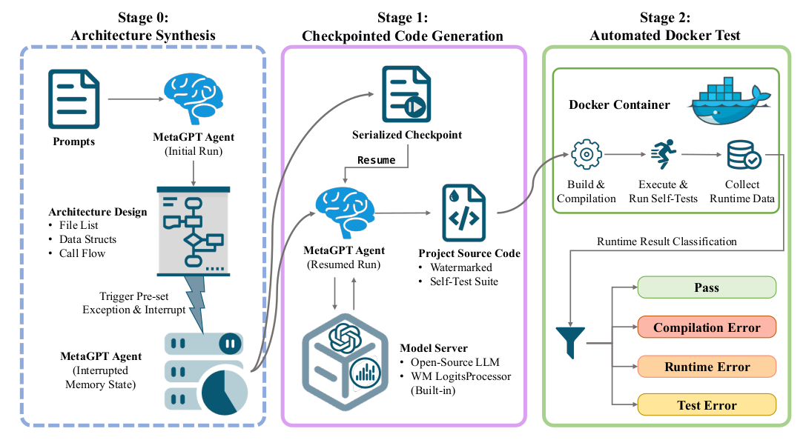
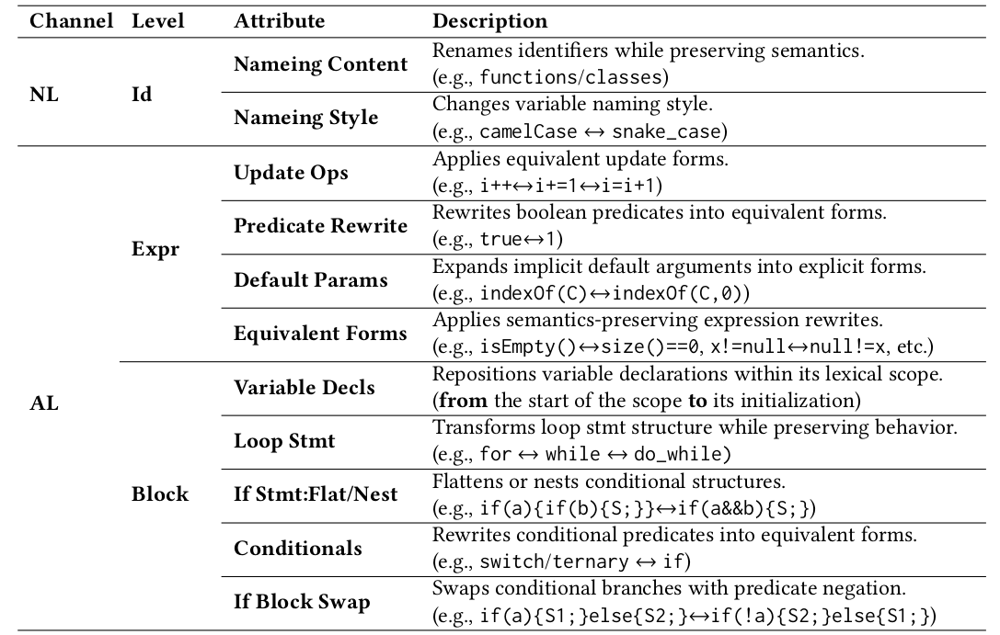

# CodeWM_ProWES: Project-Structured Evaluation for LLM-Generated Code Watermarking

This repository contains the reference implementation and artifact for the paper:

**“A Systematic Empirical Study on the Properties of Watermarking for LLM-Generated Code”** (ISSTA 2026)

It provides:
- **ProWES** (**Pro**ject-structured **W**atermarking **E**valuation **S**ystem) for end-to-end evaluation of **logits-bias** watermarking on *multi-file, buildable, executable* repositories.
- **metaProjectDEV**, a *project-level* benchmark dataset for measuring applicability + detectability of logits-bias watermarks.
- A **randomized, channel-stratified, strength-controlled transformation** framework for robustness evaluation of **semantic-preserving** watermarking methods.
- Scripts to reproduce paper results for **RQ1 / RQ2 / RQ3**.

> Note: Stage-0 architecture synthesis uses MetaGPT + a proprietary LLM API in the paper setup. The artifact is designed to be reproducible via provided checkpoints / prepared datasets; if you want to re-run Stage-0, you’ll need your own compatible API access.

---

## Applibility test:

**ProWES** is a 3-stage pipeline tailored for project-structured code watermark evaluation:

- **Stage 0 — Architecture Synthesis**
  - Generates an “ideal” repository blueprint (file list, data structures, interfaces, call flow) and a self-test suite.
- **Stage 1 — Checkpointed Code Generation**
  - Resumes from Stage-0 checkpoint; generates multi-file source code with **watermark embedded during decoding** (logits-bias watermarking).
- **Stage 2 — Automated Docker Test**
  - Builds and runs the repository in Docker; classifies runtime outcomes (Pass / Compilation Error / Runtime Error / Test Error).

This setup exposes failures that snippet/function-level benchmarks cannot capture (e.g., cross-file consistency, dependency resolution, build/test integration).

## Robustness test:

Inspired by Dual-Channel Constraints theory, we construct a hierarchical code transformation framework. This framework supports multiple programming languages and provides a diverse set of transformations. In the following, we evaluate the robustness of existing semantic-preserving watermarking methods under randomized, channel-stratified code transformation attacks:

